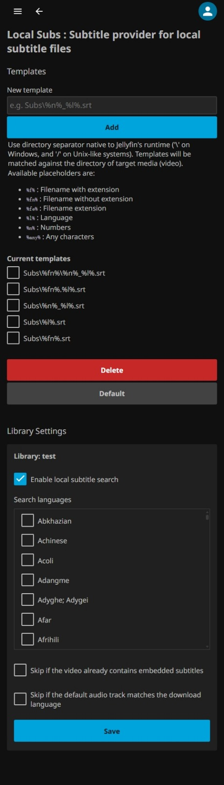

# Local Subs
> Scheduled Task Edition


Subtitle provider plugin for a path-configurable local subtitle files for Jellyfin.

Jellyfin by default has a fixed path on detecting subtitle files (srt files, etc.).

This plugin enables importing subtitles from a different path (e.g. in a `Subs` directory on the media path) by letting library owners to specify where to find subtitles local to the media (video) path via templates.

Templates supports placeholders like filename and language to add a degree of freedom on matching subtitles. For example, a t template of `Subs\%fn%.%l%.srt` will match to `Subs\My.Home.Video.2023.Spanish.srt` for media `My.Home.Video.2023.mp4`. The `%l%` placeholder will match for 3 variants of language names, the two letter (e.g. `es` for Spanish), three letter (e.g. `spa` for Spanish) and english name (e.g. `Spanish` for Spanish).

Available placeholders are:

-   `%f%` : Filename with extension
-   `%fn%` : Filename without extension
-   `%fe%` : Filename extension
-   `%l%` : Language
-   `%n%` : Any arbitrary number
-   `%any%` : Any characters (This exhaustively tries to match files/directories, so use with care)

## Versions

Install plugin version according to your Jellyfin version.

| Jellyfin version | Plugin version |
| ---------------: | -------------: |
|        `12.1.*` |    `12.1.*.*` |

## Installation

### `libicu`

If you use Linux to run Jellyfin, make sure you have `libicu` installed on your system/container for .Net runtime to be able to recognize all locale (language) identifiers.

e.g.
* Debian:
  ```
  sudo apt install libicu-devel
  ```
* Red Hat:
  ```
  sudo yum install libicu
  ```
* Arch:
  ```
  sudo pacman -S icu
  ```
* Alpine:
  ```
  apk add icu-libs icu-data-full
  ```

> `libicu` is needed by .Net runtime on Linux for full data of locales (languages) information, like language identifiers and names. This plugin uses that information provided by .Net runtime to match language identifiers on file names to languages. Most desktop Linux would probably already have this from other existing applications, but minimalistic installations or containers would probably not. Windows .Net runtime already includes all the locale data, so this step is not required on Windows.

### Install/Update plugin

#### Admin dashboard

_(Not Implemented)_

#### Manual
To install the plugin, follow these steps:

1. Stop the Jellyfin Server if it running.
2. Go to the `Releases` page and download the plugin.
3. Open file explorer and navigate to the Jellyfin plugin folder.
    > You can refer to the [Jellyfin Documentation](https://jellyfin.org/docs/general/server/plugins/#catalog) to find the plugin folder.
4. Create a folder named `localsubs-st` and enter it.
5. Extract the compressed file downloaded from `Step 2` to this folder.
6. Restart the Jellyfin Server.

To update the plugin, follow these steps:

1. Stop the Jellyfin Server if it running.
2. Go to the `Releases` page and download the new version of the plugin.
3. Open file explorer and navigate to the Jellyfin plugin folder.
    > You can refer to the [Jellyfin Documentation](https://jellyfin.org/docs/general/server/plugins/#catalog) to find the plugin folder.
4. Enter the `LocalSubs STE` plugin folder.
    > If you installed the plugin exactly as per the manual, this folder will be named `localsubs-st`.
5. Extract the compressed file downloaded from `Step 2` to this folder and replace all existing files.
6. Restart the Jellyfin Server.

## Usage

### Configuration

This plugin relies on a set of string templates and library settings to locate the required subtitles.
You must define the string templates and library settings on the plugin settings page before using it.

1. Open Jellyfin admin dashboard and navigate to `Plugins`.
2. Select `Local Subs`.
3. Click `Settings` button.

#### Templates

Scroll to the `Templates` section.

+ When you use it for the first time, you can click the `Default` button to obtain some templates.
+ Add new template:
    1. Type a new template on `New template` text input.
    2. Click `Add`.
+ Delete existing template:
    1. Select the template in the `Current templates` section.
    2. Click `Delete`.
+ Set to "default" templates:
    > **Warning**: this will override the current templates.
    1. Click `Default` button.

#### Library settings

Scroll to the `Library Settings` section.

+ Check/Uncheck `Enable local subtitle search` to enable/disable the local subtitle search function of the library.
+ In the `Search languages` section, check/uncheck the items to enable/disable the subtitle search for the corresponding languages in the library.
+ Check/Uncheck `Skip if the video already contains embedded subtitles` to enable/disable the function of skipping videos in the library that already have embedded subtitles.
+ Check/Uncheck `Skip if the default audio track matches the download language` to enable/disable the function of skipping videos in the library that already have corresponding language audio tracks.

### Use the plugin

1. After completing the plugin configuration, please go to the `Scheduled Tasks` tab in the Jellyfin admin dashboard.
2. Find `Search for local subtitles` scheduled task.
3. Start it.

## Screenshot



## Development

DotNet SDK and an editor is the minimum requirement for development.

VS Code launch settings are included to debug the plugin on Jellyfin. Debugging requires a pre-built Jellyfin server and web app. Web app build requires node as well. Simple preparation Powershell script [`prepare.ps1`](prepare.ps1) is also provided to download and build Jellyfin for debugging purposes.

Debug launch task is provided at [`.vscode/launch.json`](.vscode/launch.json) and you should change environment specific paths at [`.vscode/settings.json`](.vscode/settings.json).

Jellyfin makes it harder to set a custom ffmpeg path, so add the following entry to `jellyfin-data/config/encoding.xml` to point to your ffmpeg binary.
```xml
<EncoderAppPath>C:/path/to/your/ffmpeg/bin/ffmpeg.exe</EncoderAppPath>
```

Other instructions, please refer to development instructions at [jellyfin-plugin-template](https://github.com/jellyfin/jellyfin-plugin-template) for detailed steps.

## License

[GPLv3](LICENSE)

## Source repo

https://github.com/azam/jellyfin-plugin-localsubs

https://github.com/nosyguy/jellyfin-plugin-localsubs
